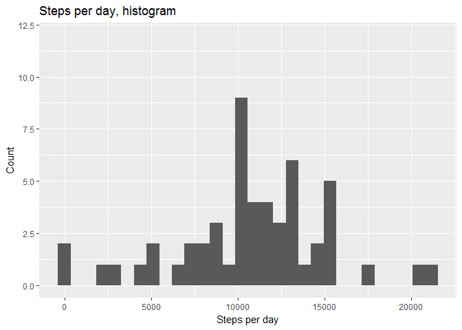
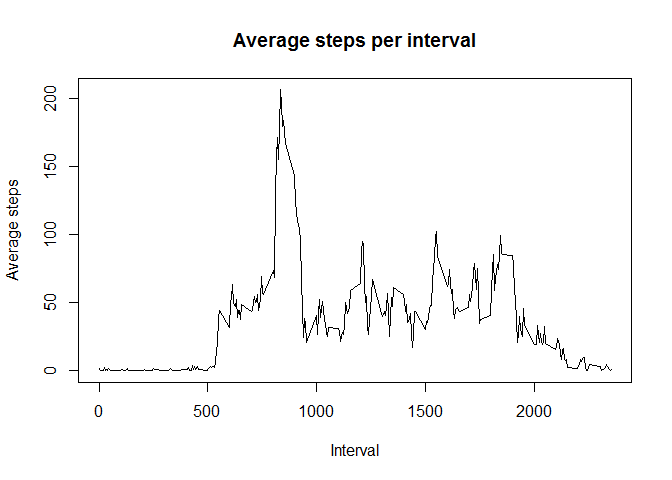
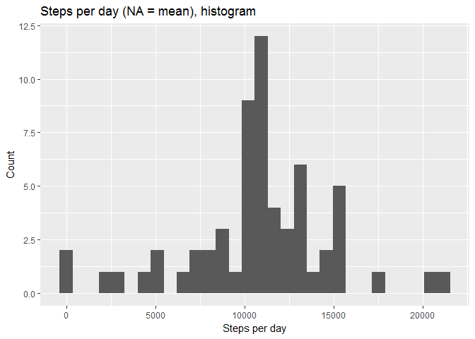
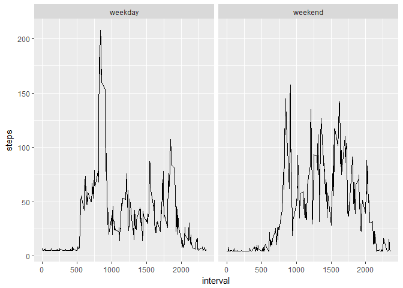

## Loading and preprocessing the data
### Reading and Preprocessing of the data 

First loading the data, saved in the working directory


```r
setwd("C://Users//648700//Desktop//Coursera//Assignments//Assignment Reproducible Research")
steps_dataset <- read.table(unz("repdata_data_activity.zip", "activity.csv"), header=T, quote="\"", sep=",")
```

Now view the dataframe to observe what transformations might be done before the analysis can start


```r
str(steps_dataset)
```

```
## 'data.frame':	17568 obs. of  3 variables:
##  $ steps   : int  NA NA NA NA NA NA NA NA NA NA ...
##  $ date    : Factor w/ 61 levels "2012-10-01","2012-10-02",..: 1 1 1 1 1 1 1 1 1 1 ...
##  $ interval: int  0 5 10 15 20 25 30 35 40 45 ...
```

Since date is a factor variable it should be transformed to a date variable


```r
steps_dataset$date  <- as.Date(steps_dataset$date)
str(steps_dataset)
```

```
## 'data.frame':	17568 obs. of  3 variables:
##  $ steps   : int  NA NA NA NA NA NA NA NA NA NA ...
##  $ date    : Date, format: "2012-10-01" "2012-10-01" ...
##  $ interval: int  0 5 10 15 20 25 30 35 40 45 ...
```

Now continue with the first assignment

## What is mean total number of steps taken per day?

First calculate the total numbers of steps per day, ignoring NAs, and then make a histogram out of it.


```r
steps_per_day <- aggregate(steps_dataset$steps, by=list(steps_dataset$date), FUN=sum)

library("ggplot2")

qplot(steps_per_day$x, main="Steps per day, histogram", xlab="Steps per day", ylab="Count", ylim = c(0,12))
```

```
## `stat_bin()` using `bins = 30`. Pick better value with `binwidth`.
```

```
## Warning: Removed 8 rows containing non-finite values (stat_bin).
```

<!-- -->
                           
### Calculate and report the mean and median of the steps per day

Calculate with the standard mean and median functions of R


```r
mean_steps <- mean(steps_per_day$x, na.rm = T)
print(mean_steps)
```

```
## [1] 10766.19
```


```r
median_steps <- median(steps_per_day$x, na.rm=T)
print(median_steps)
```

```
## [1] 10765
```

The mean of steps per day is 10766.19 and the median is 10765


## What is the average daily activity pattern?

To show this first the steps should be aggregated over all days by the interval code


```r
steps_per_5_minutes <- aggregate(steps ~ interval, steps_dataset, mean)
plot(steps_per_5_minutes$interval, steps_per_5_minutes$steps, type= 'l', xlab="Interval", ylab="Average steps", main="Average steps per interval")
```

<!-- -->

Use the R function of selecting the x-value based on the maximum value in the column


```r
steps_per_5_minutes[steps_per_5_minutes$steps==max(steps_per_5_minutes$steps),1]
```

```
## [1] 835
```

At time interval 8:35 the maximum average numbers of steps are taken respectively 206.1698 steps


## Imputing missing values

### Calculate and report the total number of missing values in the dataset (i.e. the total number of rows with NA\color{red}{\verb|NA|}NAs)

Calculate first the total number of rows and substract the number of complete cases from it


```r
nrow(steps_dataset)-sum(complete.cases(steps_dataset))
```

```
## [1] 2304
```

The number of rows with missing values is: 2304

### Devise a strategy for filling in all of the missing values in the dataset and create a new dataset where the NA's are filled in.

First create a new dataframe where we are going to update the NA values. Then replace the NA values in the column steps with the mean of steps


```r
complete_steps_data <- steps_dataset
complete_steps_data$steps[is.na(complete_steps_data$steps)] <- mean(complete_steps_data$steps, na.rm = TRUE)
```

### Make a histogram of the total number of steps taken each day and Calculate and report the mean and median total number of steps taken per day.

Take the same steps as in the first question to create the same graph with the new datafile


```r
steps_per_day_complete <- aggregate(complete_steps_data$steps, by=list(complete_steps_data$date), FUN=sum)

qplot(steps_per_day_complete$x, main="Steps per day (NA = mean), histogram", xlab="Steps per day", ylab="Count")
```

```
## `stat_bin()` using `bins = 30`. Pick better value with `binwidth`.
```

<!-- -->

Now calculate the new mean and median


```r
mean_steps_complete <- mean(steps_per_day_complete$x, na.rm = T)
print(mean_steps_complete)
```

```
## [1] 10766.19
```


```r
median_steps_complete <- median(steps_per_day_complete$x, na.rm=T)
print(median_steps_complete)
```

```
## [1] 10766.19
```

The new mean and median are now both 10766.19 

- Do these values differ from the estimates from the first part of the assignment? 

The mean is the same, however, the median changed from 10765 to 10766.19


- What is the impact of imputing missing data on the estimates of the total daily number of steps?


Replacing the NA's by the mean of steps taken doesn't affect the mean, only the median is increased in this case.


## Are there differences in activity patterns between weekdays and weekends?

### Create a new factor variable in the dataset with two levels - "weekday" and "weekend" indicating whether a given date is a weekday or weekend day.

To do this first a new column will be made with the function weekdays() and this outcome will be used to create a column indicating "weekday" or "weekend" by an ifelse function


```r
complete_steps_data$day <- weekdays(complete_steps_data$date)
complete_steps_data$type_of_day <- ifelse(complete_steps_data$day=="zaterdag"|complete_steps_data$day=="zondag", "weekend", "weekday")
```


### Make a panel plot containing a time series plot of the 5-minute interval (x-axis) and the average number of steps taken, averaged across all weekday days or weekend days (y-axis). 

First create an aggregation on steps by interval AND the type of day (weekday or weekend). Then create a panel plot via the ggplot function facet_wrap


```r
weekend_weekdays <- aggregate(steps ~ interval + type_of_day, complete_steps_data, mean)

ggplot(aes(x=interval,y=steps),data=weekend_weekdays)+geom_line()+facet_wrap(~weekend_weekdays$type_of_day)
```

<!-- -->

